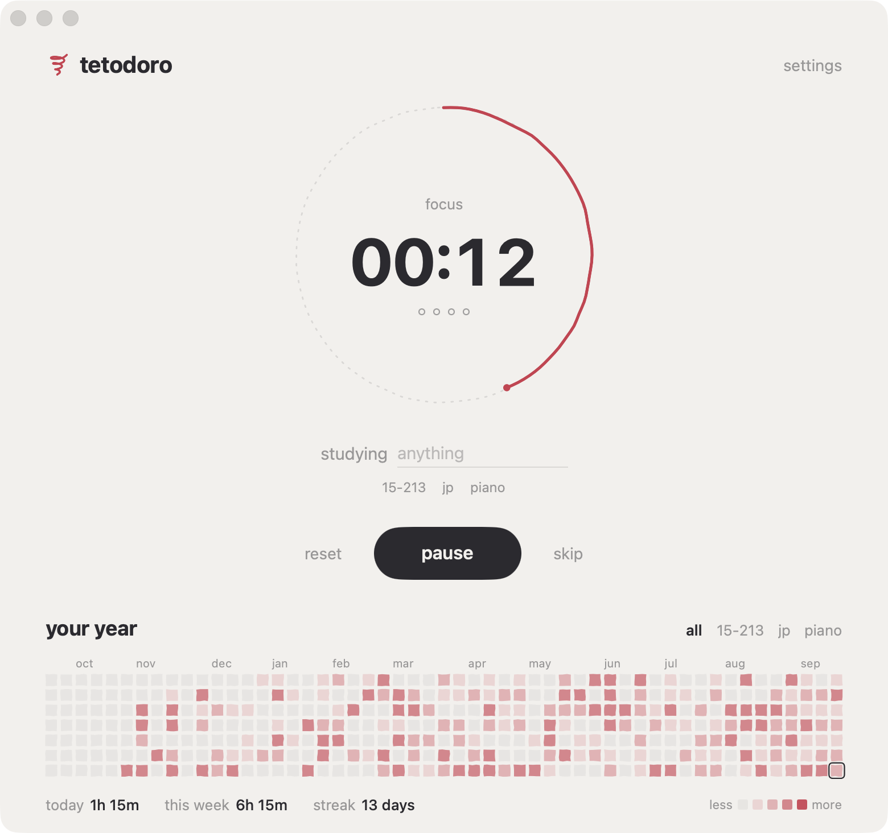
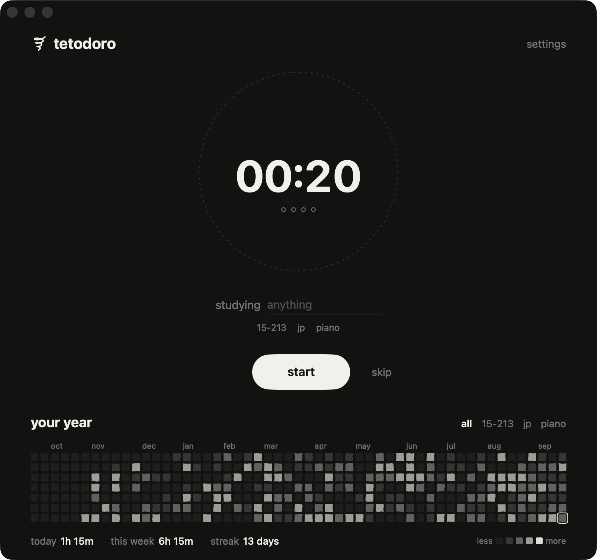

<p align="center"></p>

<h1 align="center">tetodoro</h1>

<p align="center">
  <a href="https://github.com/mmerioles/tetodoro/releases/latest"></a>
  <a href="https://github.com/mmerioles/tetodoro/actions/workflows/release.yml"></a>
  
</p>

<p align="center">
  a quiet pomodoro timer for mac.<br>
  <a href="https://mmerioles.github.io/tetodoro/"><b>mmerioles.github.io/tetodoro</b></a>
</p>

<p align="center">
  
  
</p>

- pomodoro timer with auto breaks
- tag what you're studying
- a year heatmap of your focus time
- menu bar countdown
- light and dark themes

## install

**[download the latest .dmg](https://mmerioles.github.io/tetodoro/)**, open it, and drag tetodoro into Applications.
needs macOS 15+. on first open, if macOS can't verify the app: system settings → privacy & security → open anyway.

or build it yourself (needs `xcode-select --install`):

```sh
git clone https://github.com/mmerioles/tetodoro.git && cd tetodoro && ./scripts/install.sh
```

update with `git pull && ./scripts/install.sh`.

## shortcuts

`space` start/pause · `⌘→` skip · `⌘R` reset · `⌘,` settings
